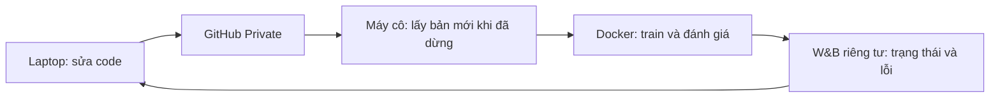

# Sửa trên laptop, huấn luyện trên máy Linux của cô

Không có CI/GitHub Actions. Máy cô không cần SSH hay mở cổng vào. Chỉ cần Internet ra ngoài, Python 3.12+, Git, Docker và NVIDIA Container Toolkit đã được chủ máy cài sẵn. Script không tự cài driver, đổi hệ thống hoặc xóa công việc khác.

Luồng sử dụng:



## 1. Chuẩn bị một lần

**Trên laptop:** code đã nằm ở repository `https://github.com/Truong583/SignLanguage-Reproduce`. Giữ repository **Private**. Sau này sửa code cùng trợ lý tại thư mục dự án, rồi chạy:

```powershell
python publish.py
```

Lệnh này dùng đăng nhập GitHub hiện có của Git trên laptop. Nó chỉ đẩy mã nguồn trong danh sách checksum; không đẩy dữ liệu, checkpoint, token hay thư mục `.updates`. Nó xác nhận repository Private trước khi đẩy. Không bật GitHub Actions và không chạy thử huấn luyện.

**Tạo W&B:** đăng ký/đăng nhập `https://wandb.ai`, tạo project tên `signlanguage-reproduction`, chọn **Private** (hoặc Team/Restricted nếu dùng team). Ghi lại tên tài khoản/team và lấy API key trong User Settings. Nên dùng tài khoản nghiên cứu riêng. Hệ thống kiểm tra project đã tồn tại và không công khai trước khi gửi log; không tự tạo project công khai. Cấu hình phạm vi xem ở [tài liệu W&B](https://docs.wandb.ai/guides/hosting/iam/access-management/restricted-projects/).

**Tạo quyền GitHub cho máy cô:** vào GitHub Settings → Developer settings → Personal access tokens → Fine-grained tokens → Generate new token. Repository access: **Only select repositories**, chọn **SignLanguage-Reproduce**. Repository permissions: **Contents: Read-only**; Metadata đọc theo mặc định. Chọn thời hạn phù hợp với thời gian train. Token không cần quyền ghi, Actions hoặc quyền toàn tài khoản. Đến hạn phải thay token trên máy cô. Không gửi token qua chat hoặc đưa vào file code.

**Trên máy cô:** đưa thư mục dự án mới sang một lần bằng ZIP/USB/Drive, giải nén vào ổ có dung lượng đủ. Mở terminal trong thư mục `SignLanguage-Reproduce`, chạy:

```bash
python3 setup_machine.py
```

Nhập tên tài khoản/team W&B, token GitHub vừa tạo và API key W&B khi được hỏi. Hai secret được nhập ẩn, lưu tại `.updates/` với quyền chỉ tài khoản Linux của bạn đọc/ghi. Không cần quyền Google Drive của cá nhân trên máy cô. Helper kiểm tra GitHub Private và W&B riêng tư; lỗi ở bước này thì chưa bắt đầu train.

Nếu archive PHOENIX đã có trên Drive: tải một lần xuống máy cô và đặt ở **`data/phoenix-2014-T.v3.tar.gz`**. Không giải nén bằng tay. Nếu chưa có, chương trình tự tải bản chính thức RWTH. Dữ liệu giải nén, manifests và weights được giữ local để các lượt sau không tải lại. Cần ít nhất 150 GiB trống cho chuẩn bị; còn phải chừa dung lượng Docker và checkpoint của 68 lượt. Đừng bắt đầu nếu ổ không đủ cho toàn chiến dịch.

## 2. Lệnh chạy hàng ngày trên máy cô

```bash
python3 run.py
```

Chạy ở **máy Linux của cô**, không chạy trên laptop để train. Mặc định chương trình chạy 68 cấu hình tái dựng PHOENIX14T–CSLR, theo catalog chung với hai notebook. Tham số paper/nguồn, các phần tác giả thiếu và giả định nằm ở [PHOENIX14T_SUITE.md](PHOENIX14T_SUITE.md) và [AUDIT.md](AUDIT.md). Batch hiệu dụng được giữ khi số GPU thay đổi; không tự giảm epoch, đổi LR hoặc kiến trúc để né lỗi.

Đây là tiến trình giám sát chạy liên tục: hoàn tất/lỗi thì **chờ**, không kết thúc như runner một lần. Mỗi 5 phút nó kiểm tra GitHub khi đã dừng huấn luyện. Trong lúc train, nó không đổi mã nguồn. Mỗi phiên dùng một bản code riêng có checksum. `python3 run.py --once` là chế độ một lượt không giám sát/cập nhật từ xa, dùng khi chưa cấu hình W&B.

## 3. Khi có lỗi

1. Trong W&B, mở project của bạn. Run loại `observer` chứa trạng thái, loss/WER theo epoch, `live_log_tail.txt` và artifact loại `runtime-error` gồm `diagnostic.json`, `log_tail.txt`. Bật nhận W&B alerts nếu muốn có thông báo. Có Internet thì log thường xuất hiện sau khoảng 30 giây cộng thời gian đồng bộ; mạng lỗi có thể chậm hơn.
2. Bạn tải hai file lỗi từ W&B rồi gửi trợ lý ở laptop; không cần vào máy cô lấy log. Trợ lý không tự nhận được dữ liệu W&B nếu chưa được bạn cung cấp/quyền kết nối.
3. Sửa code trên laptop rồi chạy **`python publish.py`**. Máy cô tự lấy bản mới khi rảnh, dựng Docker dùng cache, kiểm tra checksum/cú pháp/khả năng tiếp tục rồi chạy tiếp.

Máy cô không tự chạy lại vô hạn bản lỗi. Bản đã lỗi hoặc bị từ chối cần một commit sửa mới. Lỗi Internet chỉ làm trễ cập nhật/gửi log; log gốc vẫn ở máy cô. Khi máy tắt/mất mạng, W&B mất heartbeat; không được coi việc không có log là chắc chắn code lỗi. Chỉ nhìn heartbeat mới để kết luận trạng thái đang cập nhật.

Container giám sát dùng CPU, không có GPU, không được mount dữ liệu/weights/token GitHub/Docker socket. Thư mục `runs` được mount chỉ đọc để đọc scalar và diagnostic theo danh sách cho phép; **không upload checkpoint, ảnh/video, gloss prediction hay mã nguồn**. Nó có thể thấy tên đường dẫn nghiên cứu trong traceback. Container train tắt mạng, chỉ ghi vào các thư mục dự án được phép; Docker không bảo đảm code huấn luyện đúng hoặc đủ VRAM.

## 4. Sửa code có tiếp tục checkpoint cũ được không?

- Sửa tải dữ liệu, log, giám sát hoặc giao diện runner, giữ nguyên mô hình/loss/recipe: có thể tiếp tục checkpoint, vẫn qua kiểm tra code/config/data trong trainer.
- Sửa mô hình, loss, optimizer hoặc recipe: không được tự bỏ kiểm tra checkpoint để nối hai thí nghiệm khác nhau. Máy cô sẽ chờ. Nếu cần chạy lại đúng bản sửa, trên laptop đổi `DEPLOYMENT_POLICY.json` từ `"training_change": "pause"` sang **`"training_change": "new_campaign"`**, rồi `python publish.py`. Máy cô tạo thư mục chiến dịch mới theo commit; dữ liệu/weights dùng lại, kết quả cũ giữ nguyên.
- Đổi code dựng config ở runner mà không đổi `repro/` vẫn có thể bị trainer từ chối nếu identity khác. Khi đó phải xem log và tạo chiến dịch mới có tên riêng; không vô hiệu hóa identity.

Tiếp tục nghĩa là từ checkpoint đã lưu, phần chưa lưu phải chạy lại. Tắt nguồn đột ngột không bảo đảm file đang ghi còn nguyên; cơ chế checksum và thế hệ checkpoint dùng để phục hồi bản đã commit. Không hứa hẹn kết quả khớp từng bit khi đổi GPU/môi trường.

## 5. Đóng terminal mà máy vẫn chạy

Một lần, **trên máy cô**, dùng user service đã được tạo:

```bash
mkdir -p "$HOME/.config/systemd/user"
cp .updates/signlanguage.service "$HOME/.config/systemd/user/signlanguage.service"
systemctl --user daemon-reload
systemctl --user enable --now signlanguage.service
```

Sau đó service tự chạy `run.py`; không mở thêm `run.py` thứ hai. Dừng bằng `systemctl --user stop signlanguage.service`. Xem tình trạng bằng `systemctl --user status signlanguage.service`. Không chạy bằng `sudo`. Muốn service tiếp tục sau **đăng xuất** hoặc tự khởi động khi máy bật mà chưa đăng nhập cần chủ máy cho phép user lingering; mặc định không tự thay cấu hình này. Đóng terminal và đăng xuất là hai việc khác nhau. Nếu không dùng service, terminal phải còn mở.

## 6. Hai notebook

Colab/Kaggle tiếp tục chạy **Run all** từ ZIP trong cùng thư mục Drive, lưu checkpoint/kết quả lên Drive. Chúng dùng chung catalog 68 cấu hình; không chạy supervisor/service Linux và không yêu cầu thêm W&B token. Sau khi cập nhật project local, tạo ZIP mới và thay đúng một file `SignLanguage-Reproduce-portable.zip` trong Drive. Notebook hiện tại không tự kéo repository Private của bạn. Không chạy cùng lúc hai nền tảng vào cùng một thư mục chiến dịch.

## Giới hạn đã biết

Không có CI; chỉ kiểm tra nhanh trước kích hoạt và kiểm tra runtime khi chạy. Phần tự nhận diện lỗi chỉ dựa vào log/exit code, không chứng minh mô hình đúng về khoa học. Chưa huấn luyện PHOENIX thật, chưa nghiệm thu Docker/NCCL hay W&B bằng tài khoản/máy cô. Chỉ báo cáo đã tái lập khi có số đo dev/test thật và đối chiếu paper; các phần tác giả chưa cung cấp phải được nêu rõ trong báo cáo.
